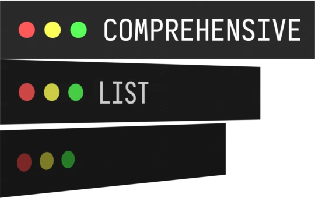

# 

A lightweight implementation of a simple click-to-view system in HTML, CSS, JavaScript and jQuery, all in under 300 lines of code. comprehensivelist features great mobile compatibility, is very extensible, and can be copied freely—this project is completely unlicensed and is meant to serve as a template for web projects of all kinds, including my personal website. 
Comments are strewn throughout the file denoting how I achieved different effects and functions. It's called *comprehensive*list, after all.
